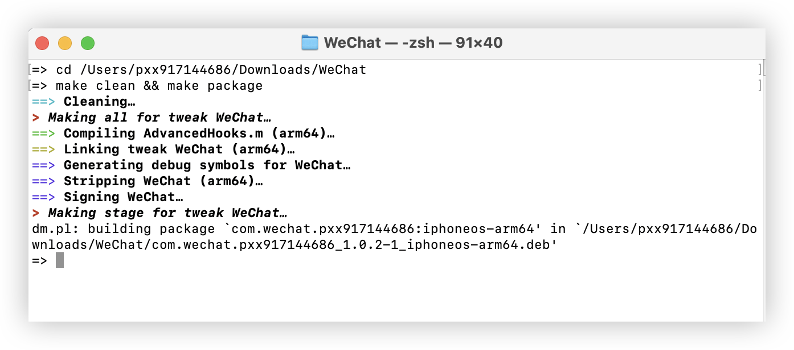

```js

🔮 Liquid Glass 扩展控制

com.apple.UIKit.DisableLiquidGlass - 禁用液态玻璃效果（全局或针对应用）
com.apple.UIKit.DisableLiquidGlassEffects - 禁用液态玻璃特效
com.apple.UIKit.LiquidGlassIntensity - 设置液态玻璃效果强度（值：0.0-1.0，默认1.0）

🎨 系统材质扩展

com.apple.UIKit.SystemMaterialsIntensity - 调整系统材质强度（值：0.0-1.0）
com.apple.UIKit.DisableSystemMaterials - 禁用系统材质

🌫️ 模糊效果扩展

com.apple.UIKit.SystemBlurIntensity - 调整系统模糊效果强度（值：0.0-1.0）
com.apple.UIKit.DisableSystemBlur - 禁用系统模糊效果

🖼️ 视图渲染控制

com.apple.UIKit.EnableVibrancy - 启用振动效果（类似模糊的动态变体）
com.apple.UIKit.ForceVibrancy - 强制启用振动效果
com.apple.UIKit.DisableVibrancy - 禁用振动效果


⚙️ 性能与兼容性

UIDesignRequiresCompatibility (Info.plist) - 设置为 -bool YES，以禁用 Liquid Glass 并确保兼容性
com.apple.UIKit.ReduceTransparency - 减少透明度，间接缓解 Liquid Glass 的效果（类似于无障碍设置）
com.apple.UIKit.ReduceMotion - 减少动作效果，降低 Liquid Glass 的动态动画


📱 特定配置

com.apple.UIKit.AppSpecificLiquidGlass - 针对特定应用启用/禁用 Liquid Glass（值：true/false）
com.apple.SwiftUI.AppIgnoreSolarium - 应用忽略 Solarium 检查（Liquid Glass 代号）


```


<!-- 图片上下排列 -->
<div style="display: flex; flex-direction: column; align-items: center; gap: 30px; margin: 20px 0;">
    
    
    
    
</div>

<hr style="border: 1px solid #ccc; margin: 20px 0;">


🔴 <font color="red">遵循 [Unlicense 许可证](https://unlicense.org/#unlicensed-free-software)</font>

🟢 <font color="green">遵循 [早期黑客文化](https://en.wikipedia.org/wiki/Hacker_culture) 是"无限制"的</font>

🔵 <font color="blue">[早期 UNIX](https://en.wikipedia.org/wiki/History_of_Unix) 是"无限制"的</font>

🟣 <font color="purple">无需保留署名</font>

🟠 <font color="orange">自由使用、修改、分发</font>

---
# [看看 👉 theos](https://theos.dev/docs/)

### Theos: 编译

make clean && make package
