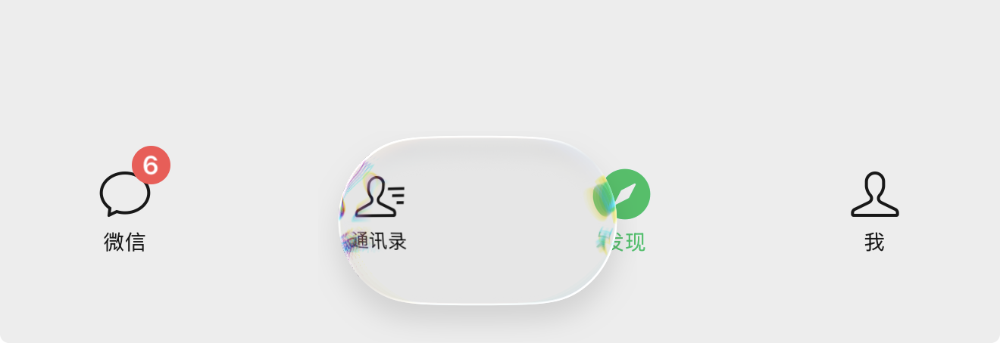
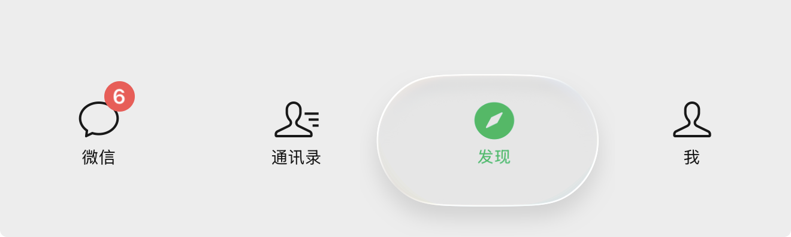
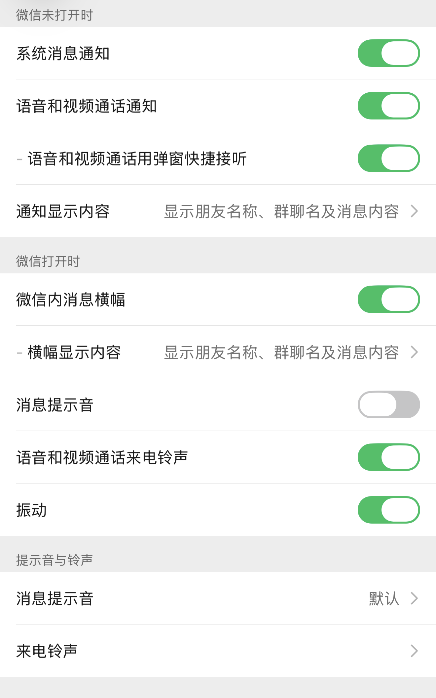

<!-- 图片上下排列 -->

    
    
    

🔴 遵循 [Unlicense 许可证](https://unlicense.org/#unlicensed-free-software)

🟢 遵循 [早期黑客文化](https://en.wikipedia.org/wiki/Hacker_culture) 是"无限制"的

🔵 [早期 UNIX](https://en.wikipedia.org/wiki/History_of_Unix) 是"无限制"的

🟣 无需保留署名

🟠 自由使用、修改、分发

---
# [看看 👉 theos](https://theos.dev/docs/)

### Theos: 编译

make clean && make package
